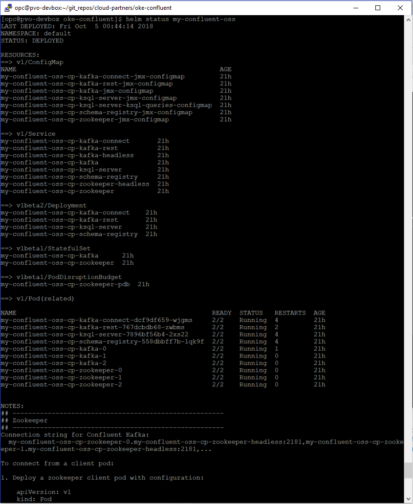
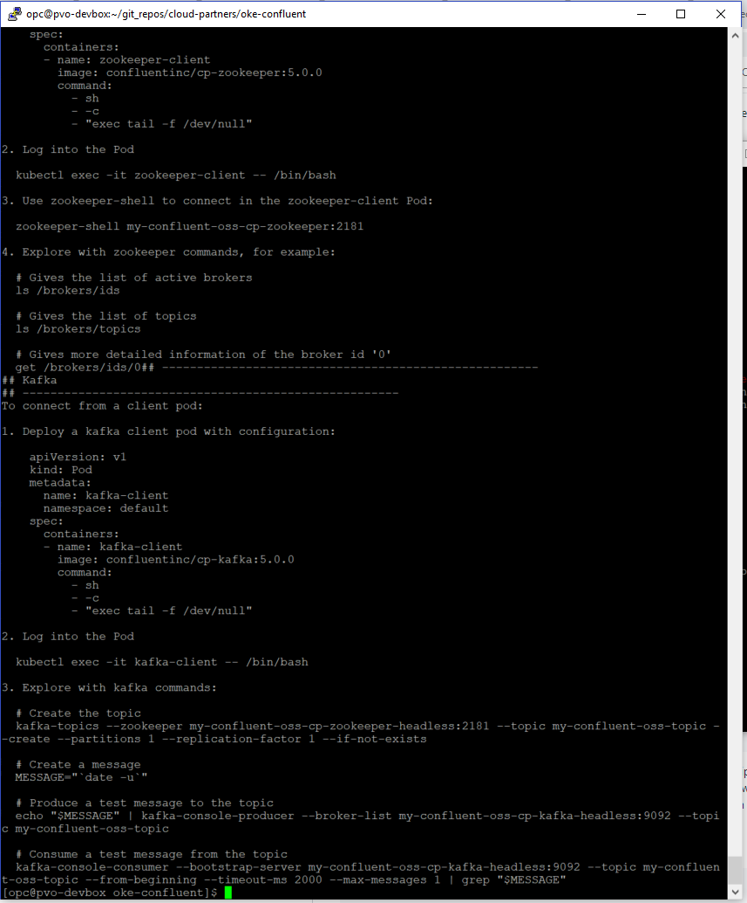

# oke-quickstart-confluent
This is a walkthrough of setting up [Confluent](https://www.confluent.io) on [Oracle Kubernetes Engine](https://cloud.oracle.com/containers/kubernetes-engine) (OKE).  It is developed jointly by Oracle and Confluent.

## Instructions
This repo contains templates for deploying [Confluent](https://www.confluent.io)  on [OCI](https://cloud.oracle.com/cloud-infrastructure) using [Oracle Kubernetes Engine (OKE)](https://cloud.oracle.com/containers/kubernetes-engine), [Helm Charts](https://docs.helm.sh/), [Terraform](https://www.terraform.io/) and scripts (bash).

Oracle Cloud Infrastructure Container Engine for Kubernetes (OKE) is a fully-managed, scalable, and highly available service that you can use to deploy your containerized applications to the cloud. Use Container Engine for Kubernetes when your development team wants to reliably build, deploy, and manage cloud-native applications. You specify the compute resources that your applications require, and Container Engine for Kubernetes provisions them on Oracle Cloud Infrastructure in an existing OCI tenancy.

Confluent Platform is a streaming platform that enables you to organize and manage data from many different sources with one reliable, high performance system.

This template installs Confluent Open Source version.

This template does the following:

1. Deploy a Kubernetes cluster on OCI in a new vcn (virtual cloud network), including nodepool across 3 availability domains (ADs).

2. On your local machine
    	a. Generate a Kube Config to access the above cluster
       	b. Install kubectl
       	c. Install helm
       	d. Add Confluent Helm Charts to helm repo

3. Install Confluent Platform on Kubernetes Cluster. (my-confluent-oss)

Kubernetes Cluster on OCI:

Confluent Pods running on the cluster:

## Prerequisites
In addition to an active tenancy on OCI, you will need a functional installation of Terraform, and an API key for a privileged user in the tenancy.  See these documentation links for more information:

1. [Getting Started with Terraform on OCI](https://docs.cloud.oracle.com/iaas/Content/API/SDKDocs/terraformgetstarted.htm)

2. [How to Generate an API Signing Key](https://docs.cloud.oracle.com/iaas/Content/API/Concepts/apisigningkey.htm#How)

3. Within the root compartment of your tenancy, a policy statement (allow service OKE to manage all-resources in tenancy) must be defined to give Container Engine for Kubernetes access to resources in the tenancy..

Once the pre-requisites are in place, you will need to copy the templates from this repository to where you have Terraform installed.

## Clone the Terraform template
Now, you'll want a local copy of this repo.  You can make that with the commands:

    git clone https://github.com/cloud-partners/oke-confluent.git
    cd oke-confluent
    ls

## Update Template Configuration
Update environment variables in config file: [env-vars](https://github.com/pvaldria/oke-confluent/blob/master/env-vars)  to specify your OCI account details like tenancy_ocid, user_ocid, compartment_ocid. To source this file prior to installation, either reference it in your .rc file for your shell's or run the following:

        source env-vars

## Deployment & Post Deployment

Deploy using standard Terraform commands

    terraform init && terraform plan && terraform apply

When the apply is complete, the infrastructure will be deployed, but confluent install on the OKE cluster will still be running.

    helm status my-confluent-oss

where "my-confluent-oss" is the name given to the Confluent install.   

